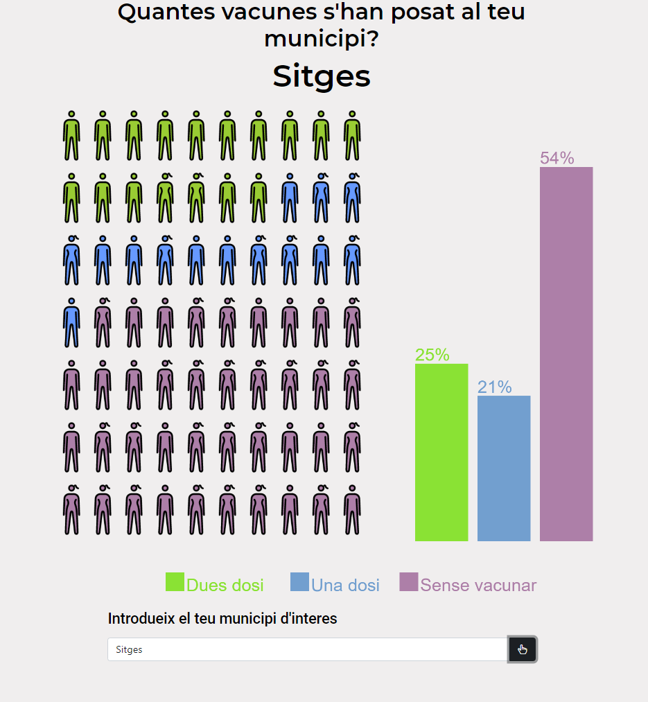

# :syringe: Vacunes Catalunya

This is a weekend project that I built to try improve my javascript and
[p5js](https://p5js.org/) skills.
The ideas and tools I have used all come mostly from
[the coding train](https://www.youtube.com/channel/UCvjgXvBlbQiydffZU7m1_aw).
YouTube channel.

(Disclaimer, this is my first "serious" javascript project so it can be improved)

The website can be accessed at
[david.masponte.com/vacunes-cat/](http://david.masponte.com/vacunes-cat/).
The user can input any municipality in
[Catalonia](https://en.wikipedia.org/wiki/Catalonia) and obtain
the percentage of vaccinated people in that municipality
both with a representative plot and a bar chart. The number of male and female
figures represents the number of doses given to women and men (probably not
the most straight-forward design). This image is from 20th of June.



This website is only a client-side application that queries a couple of
databases offered by the
[Generalitat de Catalunya](https://analisi.transparenciacatalunya.cat/)
and displays the data
with interactive graphics.

The main vaccinatio API can be accessed
[here](https://analisi.transparenciacatalunya.cat/Salut/Vacunaci-per-al-COVID-19-dosis-administrades-per-m/irki-p3c7)
. It generates a json file with an element per day that contains how many
first or second doses were administered for any given town.

## :computer: Dev notes

To test locally the changes in your browser you can run a 
[local server](https://docs.python.org/3/library/http.server.html) with
any python installation in your machine. Then go to
[`http://localhost:8000/`](http://localhost:8000/).

```bash
python -m http.server
```

## :floppy_disk: Data

* Info for inhabitants of municipalities -> [here](http://www.idescat.cat/codis/?id=50&n=9).
* API for inhabitants -> [here](http://www.idescat.cat/api/pob/)
* Vaccination api -> [here](https://analisi.transparenciacatalunya.cat/Salut/Vacunaci-per-al-COVID-19-dosis-administrades-per-m/irki-p3c7)
* To check consistency of the data -> [here](https://dadescovid.cat/?tipus=municipi&codi=08219&id_html=up_1_2&tipus_territori=territori)
